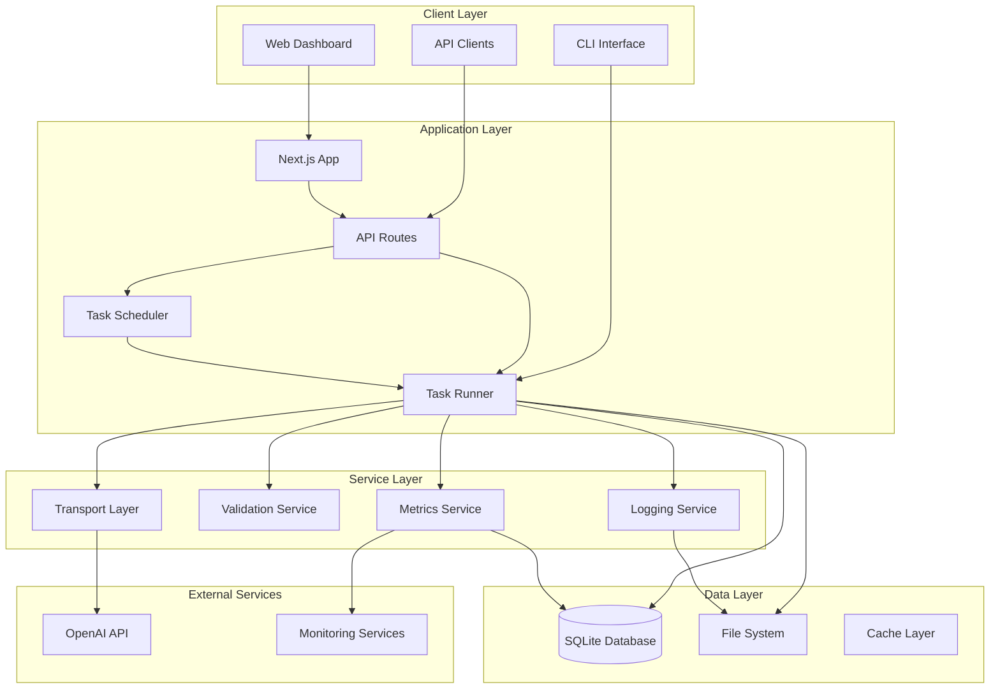

# GPT Task Runner - System Architecture

## Overview

The GPT Task Runner is a comprehensive task automation system that combines a Next.js web application with a powerful CLI tool for executing GPT-powered tasks at scale.

## System Architecture

## Component Architecture

### 1. CLI Interface (`src/cli.ts`)

- **Purpose**: Command-line interface for batch task processing
- **Key Features**:
  - File-based input (CSV, JSONL)
  - Dry-run mode
  - Resume functionality
  - Progress tracking
  - Configurable retry logic

### 2. Web Dashboard (`src/app/`)

- **Purpose**: Web-based monitoring and management interface
- **Key Features**:
  - Real-time task monitoring
  - Scheduled task management
  - Performance metrics
  - System status dashboard

### 3. Task Runner (`src/task-runner.ts`)

- **Purpose**: Core task execution engine
- **Key Features**:
  - Batch processing
  - Concurrency control
  - Error handling and retries
  - Progress checkpointing
  - Idempotency support

### 4. Transport Layer (`src/transports/`)

- **Purpose**: Abstraction for different AI service providers
- **Implementations**:
  - OpenAI Transport
  - Dry-run Transport (for testing)
- **Features**:
  - Rate limiting
  - Retry logic
  - Error classification
  - Usage tracking

### 5. Validation System (`src/validation/`)

- **Purpose**: Input validation and schema enforcement
- **Features**:
  - Task schema validation
  - File format validation
  - Configuration validation
  - Error reporting

### 6. Database Layer (`src/database/`)

- **Purpose**: Data persistence and retrieval
- **Features**:
  - Task storage
  - Metrics collection
  - Scheduled task management
  - Query optimization

## Data Flow

### Task Execution Flow

1. **Input Processing**: Tasks loaded from files or API
2. **Validation**: Schema and content validation
3. **Queuing**: Tasks queued for processing
4. **Execution**: Tasks sent to transport layer
5. **Response Processing**: Results processed and stored
6. **Output Generation**: Results written to files or database

### Scheduling Flow

1. **Schedule Definition**: Cron-based task scheduling
2. **Trigger Evaluation**: Schedule evaluation and triggering
3. **Task Creation**: Scheduled tasks converted to executable tasks
4. **Execution**: Standard task execution flow
5. **Result Storage**: Results stored with schedule metadata

## Security Architecture

### Authentication & Authorization

- API key-based authentication for external services
- Role-based access control (planned)
- Request rate limiting
- Input sanitization

### Data Security

- Sensitive data encryption at rest
- Secure API key storage
- Audit logging
- Data retention policies

## Performance Considerations

### Scalability

- Horizontal scaling support
- Database connection pooling
- Efficient batch processing
- Memory usage optimization

### Monitoring

- Performance metrics collection
- Error rate monitoring
- Resource usage tracking
- Alert configuration

## Deployment Architecture

### Development Environment

- Local development with hot reload
- In-memory database for testing
- Mock transport for development

### Staging Environment

- Production-like configuration
- Full database setup
- Real API integrations
- Performance testing

### Production Environment

- High-availability deployment
- Database clustering
- Load balancing
- Monitoring and alerting

## Technology Stack

### Frontend

- **Next.js 15**: React framework with SSR/SSG
- **TypeScript**: Type-safe development
- **Tailwind CSS**: Utility-first styling
- **Recharts**: Data visualization
- **Lucide React**: Icon library

### Backend

- **Node.js**: Runtime environment
- **Express**: API server (embedded in Next.js)
- **SQLite**: Database (with clustering support)
- **Winston/Pino**: Logging
- **Commander**: CLI framework

### Testing

- **Vitest**: Unit and integration testing
- **Playwright**: End-to-end testing
- **Coverage**: Code coverage reporting

### DevOps

- **GitHub Actions**: CI/CD pipeline
- **ESLint/Prettier**: Code quality
- **Snyk**: Security scanning
- **Docker**: Containerization (planned)

## API Design

### REST API Endpoints

- `GET /api/status` - System status
- `GET /api/metrics` - Performance metrics
- `GET /api/scheduled-tasks` - Scheduled task management
- `POST /api/scheduled-tasks` - Create scheduled task
- `PUT /api/scheduled-tasks/:id` - Update scheduled task
- `DELETE /api/scheduled-tasks/:id` - Delete scheduled task

### WebSocket API (Planned)

- Real-time task progress updates
- Live metrics streaming
- System status notifications

## Future Enhancements

### Short-term (Q1 2025)

- Docker containerization
- Kubernetes deployment
- Advanced monitoring
- API documentation

### Medium-term (Q2 2025)

- Multi-tenant support
- Advanced scheduling
- Webhook integrations
- Performance optimizations

### Long-term (Q3-Q4 2025)

- Machine learning insights
- Advanced analytics
- Third-party integrations
- Enterprise features

---

_Last Updated: September 26, 2025_
_Next Review: October 10, 2025_
